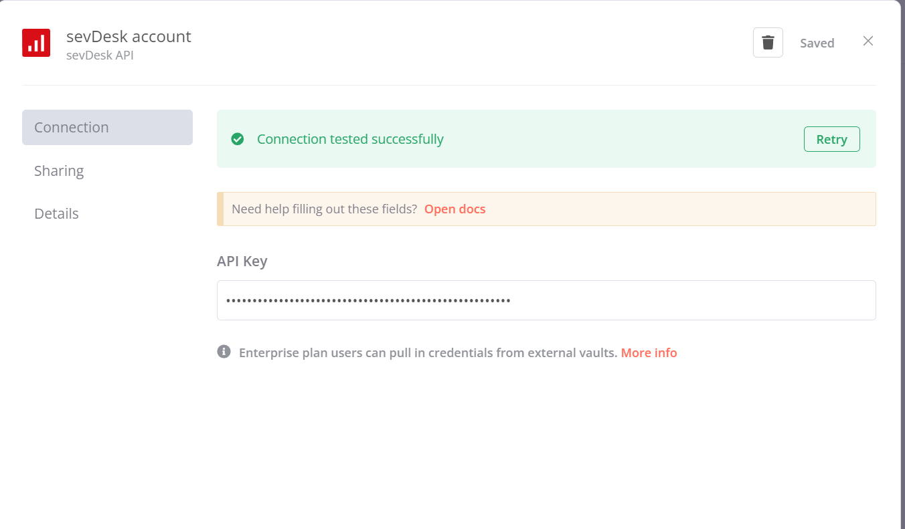

Currently in testing.

# n8n-nodes-sevdesk

This is an n8n community node. It let's you interact with the sevDesk API. SevDesk is an accounting tool based in germany. 
You'll find more information on their [website](https://sevdesk.de/).

[n8n](https://n8n.io/) is a [fair-code licensed](https://docs.n8n.io/reference/license/) workflow automation platform.

## Developer

Hi, 

My name is Nico and I am the developer of this node.
I am an independent consultant and I really like open source software.

My nodes are free to use for everyone, but please consider [donating](https://www.buymeacoffee.com/nicokowalc5) when you use my nodes.
This helps me to build and maintain nodes for everyone to use.

Also, if you are looking for some outside help with n8n, I can of course also offer my services.
* Node Development
* Workflow Development
* Mentoring
* Support

Please contact me kontakt@nicokowalczyk.de if you want to make use of my services.

For questions or issues with nodes, please open an issue on Github.

## Installation

Follow the [installation guide](https://docs.n8n.io/integrations/community-nodes/installation/) in the n8n community nodes documentation.

## Compatibility

Developed and tested in version 1.11.3

## Current Status
This node is work in progress right now. 

- [x] Contacts
	- [x] Contact
	- [x] ContactAddress
	- [x] CommunicationWay
	- [x] AccountingContact
- [x] Category
- [x] Country
- [x] Banking
	- [x] CheckAccount
	- [x] CheckAccountTransaction
- [x] Inventory
	- [x] Part
- [x] Invoice
	- [x] Invoice
- [ ] Order
	- [ ] Order
	- [ ] Order Position
- [ ] Receipt
	- [ ] Voucher
	- [ ] Voucher Position

## Operations

### Accounting Contacts

### Categories

### Check Accounts
These are the accounts you can find over here in sevdesk. https://my.sevdesk.de/admin/accounting/checkaccount

**Create** Creates new check accounts. 

**Update** Updates a check account by a given ID. 

**Delete** Deletes a check account by a given ID.

**Get Many** Gets many checked accounts. You can filter them by ID and it is also possible to do pagination with *limit* and *offset*

**Get Balance of Account for given Date** It is possible to retrieve the balance of a checked account to a given date in the past. 

### Check Account Transactions
**Create** Creates new check accounts.

**Update** Updates a check account by a given ID.

**Delete** Deletes a check account by a given ID.

**Get Many** Gets many (or one) checked account transactions. You can filter them by ID and it is also possible to do pagination with *limit* and *offset*. There are also filter opportunities.

### Communication Ways

### Contacts

### Contact Addresses

### Countries

### Invoices
**Book** This endpoint can be used to book invoices. Invoices are booked on payment accounts where (bank) transactions are located and might be linked to the transactions by using this endpoint.

**Cancel** This endpoint will cancel the specified invoice therefor creating a cancellation invoice. The cancellation invoice will be automatically paid and the source invoices status will change to "cancelled".

**Create and Update** This endpoint offers you the following functionality. <ul> <li>Create invoices together with positions and discounts</li> <li>Delete positions while adding new ones</li> <li>Delete or add discounts, or both at the same time</li> <li>Automatically fill the address of the supplied contact into the invoice address</li> </ul>

**Get Many** Gets many invoices. There are a multitude of parameter which can be used to filter. A few of them are attached but for a complete list please check out <a href="https://5677.extern.sevdesk.dev/apiOverview/index.html#/doc-invoices#filtering">this</a> list.

**Get Invoice PDF** Retrieves the pdf document of an invoice with additional metadata.

**Is Invoice Partially Paid** Returns "true" if the given invoice is partially paid - "false" if it is not. Invoices which are completely paid are regarded as not partially paid.

**Mark as sent** Marks an invoice as sent by a chosen send type

**Render Invoice** Using this endpoint you can render the pdf document of an invoice. Use cases for this are the retrieval of the pdf location or the forceful re-render of a already sent invoice. Please be aware that changing an invoice after it has been sent to a customer is not an allowed bookkeeping process

**Send via Email** This endpoint sends the specified invoice to a customer via email. This will automatically mark the invoice as sent. Please note, that in production an invoice is not allowed to be changed after this happened!

### Parts
You can see and edit your parts in the admin panel over here: https://my.sevdesk.de/admin/inventory/

Currently it is not possible to delete parts with the api of sevdesk.

**Create**
Creates a new part. Required fields are *name*, *partNumber*, *stock*, *unity*, *taxRate*.
All other fields are additional. 

**Update**
Updates fields of a part. Same like *Create* but you need to provide a valid part ID. A part id is not the part number. If you don't have a part id, you can search for your part with the part-number or part-name with *Get Many*.

**Get Many**
Retrieves all parts of the system. You can filter the returned data with some additional filters. It is also possible to paginate the returned data. 

**Get Current Stock for Part**
Gets only the information about the stock of one Item. Required parameter is part ID. A part id is not the part number. If you don't have a part id, you can search for your part with the part-number or part-name with *Get Many*.

### Units
Units can be set at: https://my.sevdesk.de/admin/system/unity in the admin panel.

**Get Many**
With this Method you get a list of all units defined in the system. 

## Credentials

1. You need to have an sevdesk account. You can create one over here [SevDesk](https://nicokowalczyk.de/sevdesk)*
2. Copy your api key -> [How-To find your API Key](https://api.sevdesk.de/#section/Authentication-and-Authorization) by SevDesks
3. Create new Credential of Type SevDesk in your n8n instance
4. Paste your API Key
5. Success!

\* *This is an affiliate link. I get a provision if you subscribe to sevdesk by following this link. If you want to sign up with sevdesk, but don't want me to get a provision, you can sign up with this link: [SevDesk](https://sevdesk.de/)*

## Resources

* [n8n community nodes documentation](https://docs.n8n.io/integrations/community-nodes/)
* [sevDesk API Documentation](https://api.sevdesk.de/)

## Kudos

1. Thank you [GitCedric](https://github.com/gitcedric) for the fundamental work on this node. You can find his Pull Request to the main n8n repo over here: https://github.com/n8n-io/n8n/pull/2787/
2. Thank you, [Bram](https://github.com/bramkn), for being such an exemplary community member. I've modeled this readme after your template and I appreciate your guidance.
3. Thank you, dear [n8n](https://github.com/n8n-io/n8n) team, for providing and continually developing this wonderful automation tool for all of us.   

## Version history

v1: initial version.
